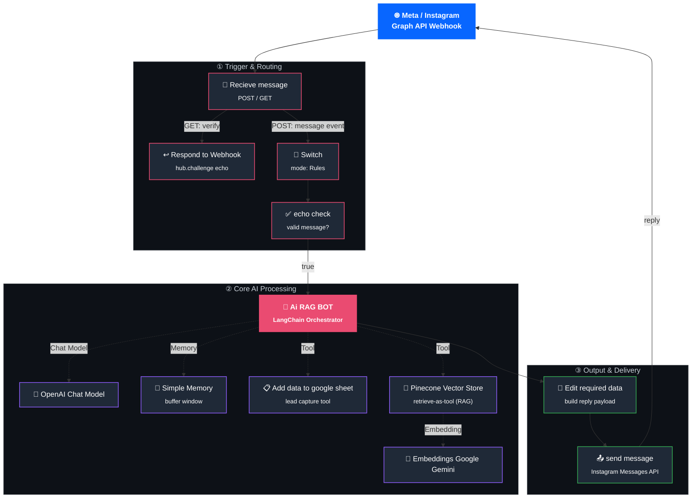

# 🗺️ Workflow Architecture

A deep technical breakdown of how **Instagram BiteRush Chatbot** processes an incoming Instagram DM from webhook receipt to reply delivery.

> 📖 For a high-level summary, see the [main README](../README.md#-workflow-architecture). This document goes one level deeper into each node's role, data flow, and design decisions.

---

## 1. High-Level Diagram



---

## 2. Execution Phases

The workflow is organized into three logical phases. Each phase has a single responsibility, which keeps the pipeline easy to debug and extend.

### Phase ① — Trigger & Routing
Responsible for receiving raw webhook traffic from Meta and filtering it down to only genuine, well-formed customer messages before any AI cost is incurred.

### Phase ② — Core AI Processing
Responsible for understanding the customer's message, retrieving grounded knowledge, remembering conversation context, and optionally logging lead data — all orchestrated by a single LangChain agent.

### Phase ③ — Output & Delivery
Responsible for reshaping the agent's raw output into the exact payload Meta's API expects, then delivering it back into the customer's DM thread.

---

## 3. Node-by-Node Technical Reference

### 3.1 Recieve message
- **Type:** `n8n-nodes-base.webhook`
- **Role:** Single entry point for all traffic from Meta.
- **Methods handled:**
  - `GET` — Meta's webhook verification handshake (`hub.mode`, `hub.verify_token`, `hub.challenge` query params).
  - `POST` — actual message event payloads sent whenever a customer DMs the connected Instagram account.
- **Output:** Raw JSON payload, branched based on HTTP method.

### 3.2 Respond to Webhook
- **Type:** `n8n-nodes-base.respondToWebhook`
- **Role:** Completes Meta's webhook verification handshake.
- **Behavior:** Only triggered on the `GET` branch. Reads the `hub.challenge` value from the incoming request and echoes it back as the HTTP response body, which is what Meta requires to confirm the endpoint is valid.

### 3.3 Switch
- **Type:** `n8n-nodes-base.switch` (mode: `Rules`)
- **Role:** First-pass filter on the `POST` branch.
- **Behavior:** Evaluates the payload structure and routes only recognized message-type events forward. Other Instagram webhook event types (e.g. message reactions, read receipts, story mentions) are discarded here so they never reach the AI layer.

### 3.4 echo check
- **Type:** `n8n-nodes-base.if`
- **Role:** Second validation gate.
- **Behavior:** Confirms the payload contains a genuine, non-empty user message field before allowing it to proceed. This prevents malformed or partial payloads from triggering unnecessary (and costly) LLM calls.

### 3.5 Ai RAG BOT
- **Type:** `@n8n/n8n-nodes-langchain.agent`
- **Role:** The central orchestrator of the entire workflow.
- **Behavior:** Receives the validated customer message and reasons over it using its connected Chat Model, Memory, and Tools (described below). It decides — per message — whether to answer directly, query the knowledge base, or log a lead, then produces the final natural-language reply.
- **Connections:**
  - **Chat Model** → OpenAI Chat Model
  - **Memory** → Simple Memory
  - **Tools** → Add data to google sheet, Pinecone Vector Store

### 3.6 OpenAI Chat Model
- **Type:** `@n8n/n8n-nodes-langchain.lmChatOpenAi`
- **Role:** The underlying LLM used by the Ai RAG BOT for reasoning and natural-language generation.

### 3.7 Simple Memory
- **Type:** `@n8n/n8n-nodes-langchain.memoryBufferWindow`
- **Role:** Maintains short-term conversational context per user, so replies remain coherent across multiple back-and-forth messages rather than treating each DM as isolated.

### 3.8 Pinecone Vector Store
- **Type:** `@n8n/n8n-nodes-langchain.vectorStorePinecone`
- **Role:** Exposed to the Ai RAG BOT as a callable **tool** (retrieve-as-tool mode), not a static pipeline step. The agent decides when a query needs grounding and calls this tool to perform semantic search over the knowledge base index.
- **Depends on:** Embeddings Google Gemini, to convert the query text into a vector before searching.

### 3.9 Embeddings Google Gemini
- **Type:** `@n8n/n8n-nodes-langchain.embeddingsGoogleGemini`
- **Role:** Generates vector embeddings for incoming queries so they can be matched against the pre-embedded documents stored in Pinecone.

### 3.10 Add data to google sheet
- **Type:** `n8n-nodes-base.googleSheetsTool`
- **Role:** Exposed to the Ai RAG BOT as a second callable **tool**. When the customer shares identifying details (name, phone number, order intent, etc.), the agent calls this tool to append a new row to a connected Google Sheet — effectively turning conversations into captured leads.

### 3.11 Edit required data
- **Type:** `n8n-nodes-base.set` (manual mode)
- **Role:** Transforms the Ai RAG BOT's raw text output into the exact JSON structure required by the Instagram Graph API's messaging endpoint — mapping fields like recipient ID and message text into their expected keys.

### 3.12 send message
- **Type:** `n8n-nodes-base.httpRequest`
- **Role:** Final delivery step. Sends a `POST` request to the Instagram Graph API `/messages` endpoint with the formatted payload, placing the AI's reply directly into the customer's DM thread.

---

## 4. Data Flow Summary

```
Instagram DM
   → Recieve message (webhook)
   → Switch (filter event type)
   → echo check (validate message)
   → Ai RAG BOT
        ├─ reads context from Simple Memory
        ├─ optionally queries Pinecone Vector Store (via Gemini Embeddings) for grounded facts
        ├─ optionally calls Add data to google sheet to log a lead
        └─ produces final reply text
   → Edit required data (format payload)
   → send message (deliver via Instagram Graph API)
   → Instagram DM (customer sees reply)
```

---

## 5. Design Notes & Rationale

- **Two-stage filtering (Switch → echo check)** exists to minimize wasted LLM calls — invalid or irrelevant webhook events are rejected before they reach the AI Agent, keeping API costs predictable.
- **Tools instead of a fixed pipeline** — Pinecone retrieval and Google Sheets logging are both wired in as *tools* the agent can call conditionally, rather than nodes that always execute. This lets the same agent handle a simple FAQ, a knowledge-grounded question, and a lead-capture conversation without separate branching logic.
- **Separation of "thinking" from "formatting"** — the Ai RAG BOT node is only responsible for producing a reply; the Edit required data node is solely responsible for shaping that reply into Meta's expected schema. This separation makes it easy to change the outbound API format later without touching the agent's prompt logic.

---

## Next Steps

- 🚀 [Installation Guide](./installation.md) — set up the workflow from scratch.
- 🔑 [Configuration Guide](./configuration.md) — credential and API key setup for every node.