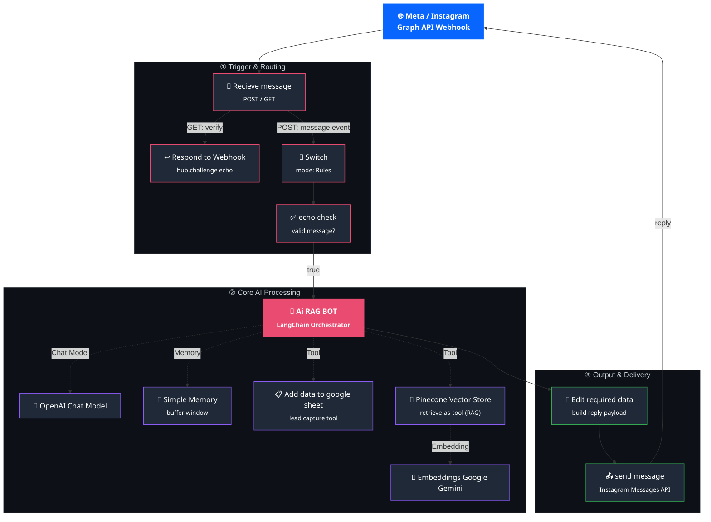

# 🍔 Instagram BiteRush Chatbot

**An AI-powered Instagram DM automation agent for Bite Rush Fast Food — built on n8n.**

The bot listens for incoming Instagram messages via the Meta Graph API, answers customer questions using a Retrieval-Augmented Generation (RAG) knowledge base, captures lead details and store into Google Sheets, and replies back to the customer in real time — all without a human in the loop.

<p align="left">
  
  
  
  
  
  
  
</p>

---

## 📌 Overview

This repository contains a production-ready **n8n workflow** that turns an Instagram business account into a 24/7 AI customer support and lead-capture assistant.

Every time a customer sends a DM, the workflow:

1. Verifies and receives the event through a Meta webhook.
2. Filters out irrelevant/system payloads so only genuine user messages reach the AI.
3. Passes the message to an **Ai RAG BOT** equipped with memory, a RAG knowledge base, and a lead-logging tool.
4. Formats the AI's answer into the shape Meta expects.
5. Sends the reply straight back to the customer's Instagram inbox.

It was built for a Fast-food brand ("Bite Rush"), but the architecture is generic enough to be reused for **any Instagram business page** that needs an AI assistant grounded in its own knowledge base.

---

## ✨ Features Section

- 🧠 **Retrieval-Augmented Generation (RAG)** — answers are grounded in a Pinecone vector store so the bot never invents menu items, prices, or policies.
- 🔀 **Multi-model AI stack** — OpenAI for conversational reasoning, Google Gemini for embeddings, and Pinecone for semantic search.
- 💬 **Conversation memory** — a buffer-window memory node keeps track of recent chat context so replies feel natural across multiple messages.
- 📋 **Automated lead capture** — customer name and phone number are extracted from the conversation and appended directly to a Google Sheet.
- ✅ **Meta webhook verification** — handles the `hub.challenge` handshake required to register the webhook with the Instagram Graph API.
- 🔁 **Smart payload routing** — `Switch` and `echo check` nodes filter out non-message webhook events before they ever reach the Ai RAG BOT, saving API cost and avoiding malformed calls.
- 📤 **Native Instagram reply delivery** — responses are POSTed straight back to the Instagram Messaging API, so conversations stay inside the native Instagram DM thread.

---

## 🗺️ Workflow Architecture



<details>
<summary><strong>📄 Prefer a plain-text view?</strong> (click to expand)</summary>

```
Meta/Instagram Webhook
        │
        ▼
     Recieve message ──(GET: verify)──▶ Respond to Webhook
        │
   (POST: message)
        ▼
      Switch ──▶ echo check (valid?) ──▶ AI RAG BOT ──┬── Chat Model → OpenAI
                                             ├── Memory     → Simple Memory
                                             └── Tools      → Google Sheets (leads)
                                                            → Pinecone Vector Store → Gemini Embeddings
        ▼
   Edit required data (build reply JSON)
        ▼
   send message → Instagram Graph API → back to customer DM
```

</details>

---

## 🧩 Node-by-Node Breakdown

| # | Node | Type | Purpose |
|---|------|------|---------|
| 1 | **Recieve message** | `n8n-nodes-base.webhook` | Entry point for the workflow. Listens on both `GET` (Meta's verification handshake) and `POST` (actual message events) methods. |
| 2 | **Respond to Webhook** | `n8n-nodes-base.respondToWebhook` | Fires only on the verification `GET` request and echoes back Meta's `hub.challenge` query parameter, completing webhook registration. |
| 3 | **Switch** | `n8n-nodes-base.switch` (Rules mode) | Inspects the incoming payload and routes it forward only when a genuine message text field is present, discarding other event types (e.g. read receipts, reactions). |
| 4 | **echo check** | `n8n-nodes-base.if` | A second validation gate that confirms the payload matches the expected structure before it's handed to the Ai RAG BOT. |
| 5 | **Ai RAG BOT** | `@n8n/n8n-nodes-langchain.agent` | The orchestrator. Receives the customer's message text, reasons over it, calls its connected tools/model as needed, and produces the final natural-language reply. |
| 6 | **OpenAI Chat Model** | `@n8n/n8n-nodes-langchain.lmChatOpenAi` | The LLM that powers the Ai RAG BOT's reasoning and response generation. |
| 7 | **Simple Memory** | `@n8n/n8n-nodes-langchain.memoryBufferWindow` | Maintains a rolling window of recent conversation turns so the agent has short-term context per user. |
| 8 | **Pinecone Vector Store** | `@n8n/n8n-nodes-langchain.vectorStorePinecone` (retrieve-as-tool) | Exposed to the Ai RAG BOT as a callable tool. Performs semantic search over the Bite Rush knowledge base index (`bite-rush-rag`) to ground answers in real, factual data. |
| 9 | **Embeddings Google Gemini** | `@n8n/n8n-nodes-langchain.embeddingsGoogleGemini` | Converts the query text into vector embeddings so Pinecone can perform similarity search. |
| 10 | **Add data to google sheet** | `n8n-nodes-base.googleSheetsTool` | A second tool exposed to the AI RAG BOT. When the customer shares their name/phone, the agent calls this tool to append a new row to the connected Google Sheet — used for lead capture. |
| 11 | **Edit required data** | `n8n-nodes-base.set` (manual mode) | Takes the Ai RAG BOT's raw output and reshapes it into the exact fields needed downstream: the reply text, the Instagram API version (pulled from the original webhook headers), and the sender/recipient IDs. |
| 12 | **send message** | `n8n-nodes-base.httpRequest` | Sends the final `POST` request to the Instagram Graph API's `/messages` endpoint, delivering the AI's reply back into the customer's DM thread. |

---

## ✅ Prerequisites & Setup

Before importing this workflow, make sure you have the following in place:

### 1. Meta Developer App
- A [Meta Developer](https://developers.facebook.com/) account with an app configured for the **Instagram Messaging API**.
- An Instagram **Professional/Business account** linked to a Facebook Page, connected to the app.
- A webhook subscription pointing to your n8n Recieve message node's public URL, with the `messages` field subscribed.
- A **Verify Token** configured in the Meta App dashboard (must match the value your workflow echoes back during the `hub.challenge` handshake).

### 2. n8n Instance
- An **n8n Cloud** workspace, or a **self-hosted** n8n instance (with LangChain nodes enabled).
- Publicly reachable webhook URL (n8n Cloud provides this automatically; self-hosted setups need a reverse proxy / tunnel).

### 3. Required API Keys & Credentials
- OpenAI API key (Chat Model)
- Google Gemini API key (Embeddings)
- Pinecone API key + an existing index populated with your knowledge base
- Google Sheets OAuth2 credentials with access to your target spreadsheet
- Instagram/Meta long-lived access token (Bearer auth for the outgoing send message node)

---

## 🔑 Environment Variables & Configuration

This workflow uses n8n **credentials** rather than plain environment variables. Set up the following credential entries inside your n8n instance before activating the workflow:

| Credential / Config | Used By | Description |
|---|---|---|
| `OpenAI API Key` | OpenAI Chat Model | Authenticates requests to OpenAI's chat completion models. |
| `Google Gemini (PaLM) API Key` | Embeddings Google Gemini | Authenticates embedding generation requests. |
| `Pinecone API Key` | Pinecone Vector Store | Grants access to your pinecone project and index. |
| `Pinecone Index Name` | Pinecone Vector Store | Name of the index holding your RAG knowledge base (e.g. `bite-rush-rag`). |
| `Google Sheets OAuth2` | Add data to google sheet | Grants write access to the target spreadsheet for lead logging. |
| `Google Sheet Document ID` | Add data to google sheet | The spreadsheet where leads are stored. |
| `Instagram Access Token` (Bearer) | send message | Used to authenticate outbound calls to the Instagram Graph API `/messages` endpoint. |
| `Meta Verify Token` | Recieve message / Respond to Webhook | Shared secret used during Meta's webhook subscription handshake. |
| `Instagram Business/Page ID` | send message URL | Your Instagram professional account ID, used in the outgoing message endpoint URL. |

> ⚠️ **Never commit real API keys or tokens to this repository.** Configure them only through n8n's built-in credentials manager.

---

## 🚀 How to Import & Run

1. **Clone this repository**
   ```bash
   git clone https://github.com/buildwithareel/Instagram-BiteRush-Chatbot
   cd Instagram-BiteRush-Chatbot
   ```

2. **Open your n8n instance** (Cloud or self-hosted).

3. **Import the workflow**
   - In n8n, go to **Workflows → Import from File**.
   - Select the `Instagram_BIteRush_Chatbot.json` file from this repository.

4. **Connect your credentials**
   - Open each credential-dependent node (OpenAI Chat Model, Embeddings Google Gemini, Pinecone Vector Store, Google Sheets, send message) and attach the corresponding credentials described above.

5. **Configure your Pinecone knowledge base**
   - Ensure your Pinecone index is populated with your business's knowledge documents (menu, hours, policies, etc.) using the same embedding model referenced in the workflow.

6. **Update business-specific values**
   - Replace the Google Sheet document ID, Pinecone index name, and Instagram account/Page ID in the relevant nodes with your own.
   - Update the Ai RAG BOT's system prompt to reflect your brand's tone, menu, and policies.

7. **Activate the Webhook**
   - Copy the **Production Webhook URL** from the Recieve message node.
   - Add it to your Meta App's webhook configuration, along with your Verify Token, and subscribe to the `messages` field.

8. **Activate the workflow**
   - Toggle the workflow to **Active** in n8n.
   - Send a test DM to your connected Instagram account to confirm the full round trip works.

9. **Monitor**
   - Use n8n's **Executions** tab to review incoming events, debug failures, and confirm replies are being sent successfully.

---

## 🔮 Future Improvements
 
- 🌍 **Multi-language support** — auto-detect the customer's language and respond in kind, instead of English-only replies.
- 🎯 **Intent classification layer** — add a dedicated intent-detection step before the Ai RAG BOT to route orders, complaints, and FAQs differently instead of relying on a single agent prompt.
- 🖼️ **Rich media replies** — extend the `send message` node to support Instagram quick replies, buttons, and product carousels instead of plain text only.
- 📊 **Analytics dashboard** — log every conversation (not just leads) to a database/Sheet and visualize response accuracy, response time, and drop-off points.
- 🛒 **Order/booking integration** — connect the Ai RAG BOT to a live ordering system (e.g. POS API) so customers can place orders directly inside the chat instead of just getting info.
- 🧪 **Automated evaluation pipeline** — leverage n8n's Evaluations tab to continuously test the agent's answers against a golden dataset and catch regressions before they reach production.
- 🔐 **Rate limiting & abuse protection** — add throttling per Instagram user ID to prevent spam/prompt-injection abuse of the AI Agent.
- 🗂️ **Dynamic knowledge base sync** — auto-refresh the Pinecone index whenever the source menu/FAQ document changes, instead of manual re-embedding.
- 🔄 **Fallback to human handoff** — detect low-confidence or escalation-worthy replies and route the conversation to a human agent (e.g. via Slack/Email alert).
- 🧾 **CRM integration** — replace/extend the Google Sheets lead logging with a proper CRM (HubSpot, Airtable, etc.) for better lead management.

---


## 📸 Screenshots & Demo

> _Screenshots and a demo walkthrough will be added here._

---

## 📄 License

This project is licensed under the [MIT License](LICENSE).

---

## 🙋‍♂️ Author

Built and maintained by **[@buildwithareel](https://github.com/buildwithareel)** — exploring AI automation, agentic workflows, and n8n-based systems.